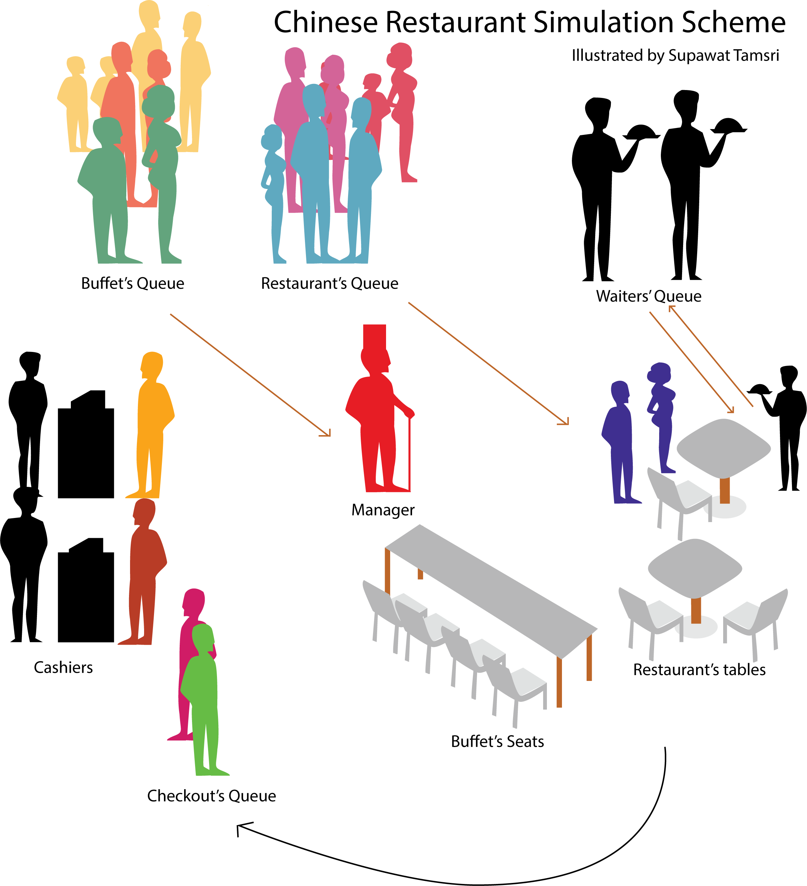

# Chinese Restaurant Simulation
Chinese Restaurant Simulation is a simulation based on activities in a Chinese restaurant between customer groups, cashiers, waiters, and manager. The restaurant has various types of queues such as buffet queue, restaurant queue, waiter queue, checkout queue. The simulation also depends on various distributions on generating random in time in services and types of customers. 
## Type of Simulation
This simulation used process interaction method based on the customer group that arrives to the restaurant interacts to the restaurant.
## Model Scheme

## Objects and Attributes
| Objects				| Class Names		| Descriptions	| Attributes |
| :-					| :-				| :-			| :-         |
| Chinese Restaurant    | ChineseRestaurant | An object that contains all objects inside the restaurant |<ol><li>random_generator</li><li>variables</li><li>manager</li><li>free_restaurant_tables</li><li>free_buffet_seats</li><li>free_waiter_queue</li><li>free_cashiers</li><li>wait_waiter_queue</li><li>restaurant_queue</li><li>buffet_queue</li><li>checkout_queue</li>|
| Variabels             | Variables         | An object that contains all variables required in the restaurant simulation can be called for generating numbers in objects |<ol><li>number_waiters</li><li>number_tables</li><li>probability_of_persons_in _group</li><li>average_arrival_interval</li><li>variance_arrival_interval</li><li>time_queue_to_table</li><li>average_waiter_service_time</li><li>average_cashier_service_time</li><li>number_cashiers</li><li>number_buffet_seats</li><li>probability_buffet_customer_group</li><li>average_buffet_time</li><li>variance_buffet_time</li></ol>|
| Seat  | Seat | A seat is a component for both buffet and table for a customer to occupied during the services | <ol><li>Seat()</li><li>~Seat()</li><li>GetSeatId()</li><li>IsEmpty()</li><li>OnSit()</li><li>OnLeave()</li><li>seat_global_id_</li><li>seat_id_</li><li>occupied_customer_</li>|
|Table|Table|A table consists of seats and actions for the customer group|<ol><li>Table()</li><li>~ Table()</li><li>GetTableId()</li><li>GetSeatNumber()</li><li>IsFree()</li><li>OnSit()</li><li>OnLeave()</li><li>occupied_customer_group_</li><li>table_id_</li><li>table_global_id</li><li>seats_</li></ol>|
|Customer|Customer|A person inside the customer group|<ol><li>Customer()</li><li>GetPersonId()</li><li>customer_id_</li><li>customer_global_id</li></ol>|
|Customer Group|CustomerGroup|A customer group consists of customers and actions for executing the process|<ol><li>CustomerGroup()</li><li>State</li><li>IsTerminated()</li><li>GetCustomerGroupId()</li><li>PersonsInGroup()</li><li>IsBuffetCustomer()</li><li>GetCustomerMember()</li><li>AssignTable()</li><li>AssignState()</li><li>Activate()</li><li>chinese_restaurant_</li><li>customer_group_global_id_</li><li>customer_group_id_</li><li>service_time_</li><li>cashier_time_</li><li>is_buffet_customer_</li><li>customer_members_</li><li>cashier_</li><li>served_by_</li><li>table_</li><li>buffet_seats_</li><li>process_</li><li>state_</li><li>terminated_</li><li>log_</li><li>CallManager()</li><li>SitOnTable()</li><li>AssignWaiter()</li><li>ActivateWaiter()</li><li>LeaveTable()</li><li>LeaveWaiter()</li><li>AssignBuffetSeats()</li><li>SitOnBuffetSeats()</li><li>LeaveBuffetSeats()</li><li>AssignCashier()</li><li>ActivateCashier()</li><li>LeaveCashier()</li><li>Execute()</li><li>CustomerArrives()</li><li>CreateNextCustomerGroup()</li><li>CustomerGroupWaitsInRestaurantQueue()</li><li>CustomerGroupWaitsInBuffetQueue()</li><li>CustomerGroupInCheckoutQueue()</li><li>CustomerGroupArrivesToTable()</li><li>CustomerGroupWaitsTheWaiter()  </li><li>CustomerGroupInRestaurantService()</li><li>CustomerGroupInBuffetService()</li><li>CustomerGroupLeaveService()</li><li>CustomerGroupInCashier()</li><li>CustomerGroupComplete()</li></ol>|
|Waiter|Waiter|A waiter provides service to the customer group in restaurant service|<ol><li>Waiter()</li><li>~Waiter()</li><li>GetWaiterId()</li><li>ProvideSErviceTo()</li><li>CompleteService()</li><li>IsAvailable()</li><li>waiter_id_</li><li>waiter_global_id_</li><li>service_to_</li><li>log_</li></ol>|
|Manager|Manager|A manager manages the restaurant queue to the restaurant table according to the strategy of the restaurant|<ol><li>Manager()</li><li>Manages</li><li>chinese_restaurant_</li></ol>|
## Block Diagram

## Attributes in Objects
#### Chinese Restaurant (ChineseRestaurant Struct)
Chinese Restaurant Struct is the object which contains data being used inside the restaurant for the objects can refer to which allowing the objects can communiates to each other